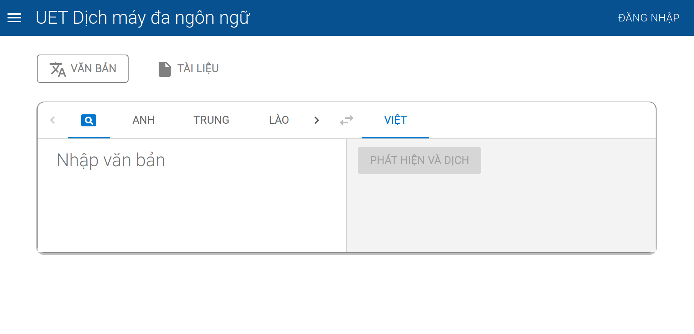

<div id="top"></div>
<!--
*** Thanks for checking out the Best-README-Template. If you have a suggestion
*** that would make this better, please fork the repo and create a pull request
*** or simply open an issue with the tag "enhancement".
*** Don't forget to give the project a star!
*** Thanks again! Now go create something AMAZING! :D
-->


<!-- PROJECT SHIELDS -->
<!--
*** I'm using markdown "reference style" links for readability.
*** Reference links are enclosed in brackets [ ] instead of parentheses ( ).
*** See the bottom of this document for the declaration of the reference variables
*** for contributors-url, forks-url, etc. This is an optional, concise syntax you may use.
*** https://www.markdownguide.org/basic-syntax/#reference-style-links
-->
[![Contributors][contributors-shield]][contributors-url]
[![Forks][forks-shield]][forks-url]
[![Stargazers][stars-shield]][stars-url]
[![Issues][issues-shield]][issues-url]
[![MIT License][license-shield]][license-url]
[![LinkedIn][linkedin-shield]][linkedin-url]


<!-- PROJECT LOGO -->
<br />
<div align="center">
    <a href="https://github.com/KCDichDaNgu/KC4.0_DichDaNgu_BackEnd">
        
    </a>

  <h3 align="center">KC4.0 dịch đa ngữ (Backend)</h3>

  <p align="center">
    Tài liệu mô tả chi tiết cách cài đặt, sử dụng phần mềm KC4.0 dịch đa ngữ (phần backend)
    <br />
    <a href="https://github.com/KCDichDaNgu/KC4.0_DichDaNgu_BackEnd"><strong>Chi tiết tài liệu »</strong></a>
    <br />
    <br />
    <!-- <a href="https://github.com/KCDichDaNgu/KC4.0_DichDaNgu_BackEnd">View Demo</a>
    · -->
    <a href="https://github.com/KCDichDaNgu/KC4.0_DichDaNgu_BackEnd/issues">Báo cáo lỗi</a>
    ·
    <a href="https://github.com/KCDichDaNgu/KC4.0_DichDaNgu_BackEnd/issues">Yêu cầu tính năng</a>
  </p>
</div>


<!-- TABLE OF CONTENTS -->
<details>
    <summary>Mục lục</summary>
    <ol>
        <li>
            <a href="#giới-thiệu">Giới thiệu</a>
            <ul>
                <li><a href="#công-nghệ">Công nghệ</a></li>
            </ul>
        </li>
        <li>
            <a href="#bắt-đầu">Bắt đầu</a>
            <ul>
                <li><a href="#điều-kiện">Điều kiện</a></li>
                <li><a href="#cài-đặt">Cài đặt</a></li>
            </ul>
        </li>
        <li><a href="#sử-dụng">Sử dụng</a></li>
        <!-- <li><a href="#roadmap">Roadmap</a></li> -->
        <li><a href="#đóng-góp">Đóng góp</a></li>
        <li><a href="#giấy-phép">Giấy phép</a></li>
        <li><a href="#liên-hệ">Liên hệ</a></li>
        <!-- <li><a href="#acknowledgments">Acknowledgments</a></li> -->
    </ol>
</details>


<!-- ABOUT THE PROJECT -->
## Giới thiệu

<br/>



<br/>
<br/>

Dự án này là một phần của hệ thống <strong>KC4.0 dịch đa ngữ</strong>, đóng vai trò xử lý, chuyển tiếp những yêu cầu dịch 
phát sinh từ phía người dùng đến các api dịch, phát hiện ngôn ngữ. Chi tiết hơn, một số chức năng quan trọng của hệ thống có 
thể kể đến như:
*   Xử lý yêu cầu dịch văn bản
*   Xử lý yêu cầu dịch tệp, các định dạng tệp được hỗ trợ bao gồm: xlsx, docx, txt, pptx
*   Lưu trữ lịch sử dịch
*   Quản lý thông số hệ thống
*   Quản lý người dùng hệ thống, thiết lập các ngưỡng giới hạn dịch

<p align="right">(<a href="#top">Trở lại đầu trang</a>)</p>


### Công nghệ

Hệ thống được xây dựng dựa trên những công nghệ dưới đây

*   [Sanic](https://sanic.dev/)
*   [MongoDB](https://www.mongodb.com/)
*   [Nginx](https://www.nginx.com/)

<p align="right">(<a href="#top">Trở lại đầu trang</a>)</p>


<!-- GETTING STARTED -->
## Bắt đầu

### Điều kiện

Trước khi cài đặt hệ thống, đảm bảo môi trường được thiết lập như sau:
*   Ubuntu 20.04 (Khuyến khích)
*   Python phiên bản >= 3.8 (Khuyến khích)
*   MongoDB phiên bản >= 4.0, có thiết lập ReplicaSet
*   Nginx phiên bản >= 1.18.0
*   Pyenv

Dưới đây là những bước chi tiết để cài đặt hệ thống
*   Cài đặt [Python](https://docs.python-guide.org/starting/install3/linux/) 
*   Cài đặt Nginx
    ```sh
    sudo apt update
    ```
    ```sh
    sudo apt install nginx
    ```
    ```sh
    sudo ufw enable
    ```
    ```sh
    sudo ufw allow 'Nginx Full'
    ```
    ```sh
    sudo systemctl start nginx
    ```
* Cài đặt [MongoDB](https://docs.mongodb.com/manual/tutorial/install-mongodb-on-ubuntu/)
* Thiết lập MongoDB ReplicaSet

    *   Cài đặt mongosh
        ``` sh
        wget -qO - https://www.mongodb.org/static/pgp/server-5.0.asc | sudo apt-key add -
        ```
        ```sh
        sudo apt-get install gnupg
        ```
        ```sh
        wget -qO - https://www.mongodb.org/static/pgp/server-5.0.asc | sudo apt-key add -
        ```
        ```sh
        echo "deb [ arch=amd64,arm64 ] https://repo.mongodb.org/apt/ubuntu focal/mongodb-org/5.0 multiverse" | sudo tee /etc/apt/sources.list.d/mongodb-org-5.0.list
        ```
        ```sh
        sudo apt-get update
        ```
        ```sh
        sudo apt-get install -y mongodb-mongosh
        ```
 
    *   Thiết lập ReplicaSet

        ```sh
        sudo systemctl stop mongod
        ```
        ```sh
        sudo mkdir -p /srv/mongodb/db0
        ```
        ```sh
        sudo mongod --port 27017 --dbpath /srv/mongodb/db0 --replSet rs0 --bind_ip localhost
        ```
        ```sh
        mongosh
        ```
    *   Thêm vào câu lệnh sau
        ```
        > rs.initiate()
        ```
        (*) Nếu thất bại, thêm nội dung dưới đây vào cuối tệp /etc/mongod.conf
        ```yaml
        replication:
            replSetName: rs0
            oplogSizeMB: 100
        ```
* Cài đặt Pyenv
    ```sh
    sudo apt install python3.8-venv 
    ```

### Cài đặt

1.  Tải repo xuống
    ```sh
    git clone https://github.com/your_username_/KC4.0_DichDaNgu_BackEnd
    ```
2.  Chuyển hướng vào thư mục của dự án
3.  Tạo môi trường ảo (trong thư mục dự án) 
    ```sh
    python3 -m venv .venv
    ```
    ```sh
    source .venv/bin/activate
    ```
4.  Cài đặt các gói thư viện
    ```sh
    pip install -r requirements.txt
    ```
    <strong>(*)</strong> Nếu gặp lỗi khi cài đặt các thư viện xử lý tệp do setuptools
   
    ```sh
    pip install -U setuptools
    ```
5.  Tạo tệp chứa biến môi trường dựa trên tệp .env.example
    ```
    cp .env.example .env.development
    ```
    Sửa các biến quan trọng nếu cần thiết, ví dụ:
    ```yaml
    SANIC_MONGODB_DATABASE # thông tin kết nối với mongodb
    SANIC_PUBLIC_TRANSLATION_API # kết nối với api dịch
    SANIC_PUBLIC_LANGUAGE_DETECTION_API # kết nối với api nhận diện ngôn ngữ 
    ```
6.  Thêm dữ liệu ban đầu
    ```sh
    sudo systemctl start mongod # Nếu chưa chạy
    ```
    ```sh
    python3 src/server.py run-seed-db
    ```
7.  Thiết lập Nginx (Cần thực hiện trước [các bước cài đặt của frontend](https://github.com/KCDichDaNgu/KC4.0_DichDaNgu_FrontEnd))
    *   Thêm tệp cấu hình

        ```
        sudo nano /etc/nginx/sites-available/translation_conf
        ```
    *   Thêm nội dung sau vào tệp
        ```Nginx
        server {
            listen 80;
            listen [::]:80;

            root /var/www/translation_client; # đây là thư mục chứa thư mục build của client
            index index.html index.htm index.nginx-debian.html;

            server_name <servername>; # Chỉnh sửa lại tên server 

            location / {
                try_files $uri $uri/ =404;
            }
        }
        ``` 
    *   Cập nhật thiết lập và khởi động lại nginx
        ```sh
        sudo ln -sf /etc/nginx/sites-available/translation_conf /etc/nginx/sites-enabled/
        ```
        ```sh
        sudo nginx -t && sudo systemctl restart nginx
        ```
8.  Cài đặt chứng chỉ ssl (Nếu cần thiết)
    *   Cài đăt Certbot và các thư viện đi kèm:

        ```sh
        sudo apt install certbot python3-certbot-nginx
        ```
        ```sh
        sudo certbot --nginx -d <domain>
        ```
    *   Nhập email (nếu được yêu cầu), đồng ý điều khoản sử dụng, sau khi bot tạo cert thành công sẽ hỏi như sau:
        ```
        Output
        Please choose whether or not to redirect HTTP traffic to HTTPS, removing HTTP access.
        - - - - - - - - - - - - - - - - - - - - - - - - - - - - - - - - - - - - - - - -
        1: No redirect - Make no further changes to the webserver configuration.
        2: Redirect - Make all requests redirect to secure HTTPS access. Choose this for
        new sites, or if you're confident your site works on HTTPS. You can undo this
        change by editing your web server's configuration.
        - - - - - - - - - - - - - - - - - - - - - - - - - - - - - - - - - - - - - - - -
        Select the appropriate number [1-2] then [enter] (press 'c' to cancel):
        ```
    *   Chọn 2 và ấn Enter. Tạo chứng chỉ thành công.
        ```
        Output
        IMPORTANT NOTES:
        - Congratulations! Your certificate and chain have been saved at:
        /etc/letsencrypt/live/<server name>/fullchain.pem
        Your key file has been saved at:
        /etc/letsencrypt/live/<server name>/privkey.pem
        Your cert will expire on 2020-08-18. To obtain a new or tweaked
        version of this certificate in the future, simply run certbot again
        with the "certonly" option. To non-interactively renew *all* of
        your certificates, run "certbot renew"
        - If you like Certbot, please consider supporting our work by:

        Donating to ISRG / Let's Encrypt:   https://letsencrypt.org/donate
        Donating to EFF:                    https://eff.org/donate-le
        ```
9.  Chỉnh sửa tệp 
    ```sh
    sudo nano /etc/nginx/site-availables/translation_conf
    ```
10. Sửa lại tệp /etc/nginx/sites-available/translation_conf với nội dung sau: 

    <strong>(*) Cần cập nhật \<server name\>, \<domain name\></strong>
    
    ```Nginx
    server {
        listen 80; # --> Port của client
        listen [::]:80; # --> Port của client
        server_name <server name>;
        root /var/www/translation_client;
        index index.html index.htm;
    
        location / {
            try_files $uri /index.html =404;
        }

        # Nếu không dùng https có thể xóa nội dung này, nếu không sử dụng ssl thì chức năng đăng nhập bằng google sẽ không hoạt động
        # ssl config start
        listen [::]:443; 
        ssl on;
        listen 443 ssl;
        ssl_certificate /etc/letsencrypt/live/<domain name>/fullchain.pem; # --> Đường dẫn cert của cert vừa tạo 
        ssl_certificate_key /etc/letsencrypt/live/<domain name>/privkey.pem; # --> Đường dẫn cert_key của cert vừa tạo 
        include /etc/letsencrypt/options-ssl-nginx.conf;
        ssl_dhparam /etc/letsencrypt/ssl-dhparams.pem;
        # ssl config end
    }

    upstream <server name> {
        keepalive 100;
        server 127.0.0.1:8001;
        #server unix:/tmp/sanic.sock;
    }
    
    server {
        server_name <server name>;
        listen 8000;
        listen [::]:8000;
        # Serve static files if found, otherwise proxy to Sanic
        location / {
            root /var/www;
            try_files $uri @sanic;
        }
        
        location @sanic {
            proxy_pass http://$server_name;
            # Allow fast streaming HTTP/1.1 pipes (keep-alive, unbuffered)
            proxy_http_version 1.1;
            proxy_request_buffering off;
            proxy_buffering off;
            # Allow websockets
            proxy_set_header connection "upgrade";
            proxy_set_header upgrade $http_upgrade;
        }

        # Nếu không dùng https có thể xóa nội dung này, nếu không sử dụng ssl thì chức năng đăng nhập bằng google sẽ không hoạt động
        # ssl config start
        listen [::]:443; 
        ssl on; 
        listen 443 ssl; 
        ssl_certificate /etc/letsencrypt/live/<domain name>/fullchain.pem; 
        ssl_certificate_key /etc/letsencrypt/live/<domain name>/privkey.pem; 
        include /etc/letsencrypt/options-ssl-nginx.conf; 
        ssl_dhparam /etc/letsencrypt/ssl-dhparams.pem; 
        # ssl config end
    }
    ```
    <strong>(*)</strong> Nếu gặp vấn đề không có tệp options-ssl-nginx.conf thì có thể tải [tại đây](https://github.com/certbot/certbot/blob/master/certbot-nginx/certbot_nginx/_internal/tls_configs/options-ssl-nginx.conf) và thêm vào thư mục /etc/letsencrypt/ 
11. Cập nhật lại cấu hình vào khởi động lại nginx
    ```sh
    sudo ln -sf /etc/nginx/sites-available/translation_conf /etc/nginx/sites-enabled/
    ```
    ```sh
    sudo nginx -t && sudo systemctl restart nginx
    ```

<p align="right">(<a href="#top">Trở lại đầu trang</a>)</p>


<!-- USAGE EXAMPLES -->
## Sử dụng

Để chạy hệ thống, thực hiện các bước sau:
1.  Chuyển hướng vào thư mục dự án
2.  Chạy câu lệnh 

    ```sh
    python3 src/server.py run-server -p 8001
    ```
    <strong>(*)</strong> Chú ý cần khởi động mongodb trước khi chạy và kiểm tra cổng 80 và 8000 đã mở hay chưa

<p align="right">(<a href="#top">Trở lại đầu trang</a>)</p>


<!-- CONTRIBUTING -->
## Đóng góp

TODO

<p align="right">(<a href="#top">Trở lại đầu trang</a>)</p>


<!-- LICENSE -->
## Giấy phép

TODO

<!-- Distributed under the MIT License. See `LICENSE.txt` for more information. -->

<p align="right">(<a href="#top">Trở lại đầu trang</a>)</p>


<!-- CONTACT -->
## Liên hệ

TODO

<!-- Your Name - [@your_twitter](https://twitter.com/your_username) - email@example.com

Project Link: [https://github.com/your_username/repo_name](https://github.com/your_username/repo_name) -->

<p align="right">(<a href="#top">Trở lại đầu trang</a>)</p>


<!-- MARKDOWN LINKS & IMAGES -->
<!-- https://www.markdownguide.org/basic-syntax/#reference-style-links -->
[contributors-shield]: https://img.shields.io/github/contributors/othneildrew/Best-README-Template.svg?style=for-the-badge
[contributors-url]: https://github.com/KCDichDaNgu/KC4.0_DichDaNgu_BackEnd/graphs/contributors
[forks-shield]: https://img.shields.io/github/forks/othneildrew/Best-README-Template.svg?style=for-the-badge
[forks-url]: https://github.com/KCDichDaNgu/KC4.0_DichDaNgu_BackEnd/network/members
[stars-shield]: https://img.shields.io/github/stars/othneildrew/Best-README-Template.svg?style=for-the-badge
[stars-url]: https://github.com/KCDichDaNgu/KC4.0_DichDaNgu_BackEnd/stargazers
[issues-shield]: https://img.shields.io/github/issues/othneildrew/Best-README-Template.svg?style=for-the-badge
[issues-url]: https://github.com/KCDichDaNgu/KC4.0_DichDaNgu_BackEnd/issues
[license-shield]: https://img.shields.io/github/license/othneildrew/Best-README-Template.svg?style=for-the-badge
[license-url]: https://github.com/KCDichDaNgu/KC4.0_DichDaNgu_BackEnd/blob/master/LICENSE.txt
[linkedin-shield]: https://img.shields.io/badge/-LinkedIn-black.svg?style=for-the-badge&logo=linkedin&colorB=555
[linkedin-url]: https://linkedin.com/in/othneildrew
[product-screenshot]: images/screenshot.png